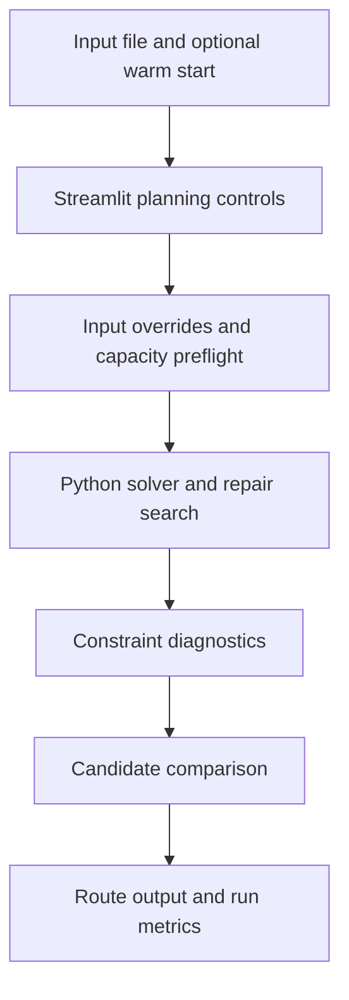

# Architecture and technical decisions

[Back to overview](../README.md)

## Planning model

The planning problem combines recurring service requirements with assignment to representatives and days. Relevant controls include minimum/maximum daily visits, visit frequency, working-day duration, lunch settings and workload deviation. Geographic overlap is a separate quality measure, not a substitute for feasibility.

## Interface responsibilities

The local Streamlit interface accepts a planning file and optional warm-start outputs. It exposes workload/geometry preferences, a run-time budget and daily capacity settings. Input overrides are recorded with run artifacts, allowing results to be interpreted alongside their configuration.

The UI code separates input editing, solver loading, metric parsing and execution. It includes capacity-preflight logic rather than treating every uploaded instance as trivially solvable.

## Search design

The development history includes neighborhood search, large-neighborhood-search experiments, repair moves and warm-start candidates. Feasibility-oriented experiments prioritize duration violations before polishing route geometry. Workload and overlap are still useful diagnostics, but a better overlap score does not establish a valid solution.

Cheap proxy metrics help compare many candidates. More expensive geometric checks are reserved for selected candidates or final comparison. This is a computational trade-off: a proxy permits more search within a budget, while final diagnostics expose differences between the proxy and the reported route quality.

## Important distinctions

- Nearest-neighbor overlap, convex overlap and alpha-shape overlap are different measurements; their percentages are not interchangeable.
- A lower-bound duration check is not a completed feasible route.
- Configurable time budgets are inputs, not a guaranteed performance benchmark.
- Versioned experiments represent development alternatives, not a claim that every variant improves every instance.

## Publication boundary

This diagram describes the reviewed local workflow at a high level. The public repository contains no operational customer locations, solver source, raw run logs or executable deployment.
